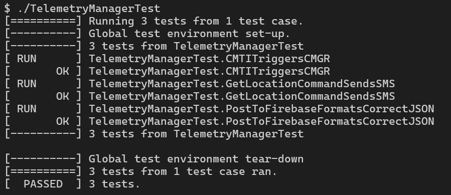
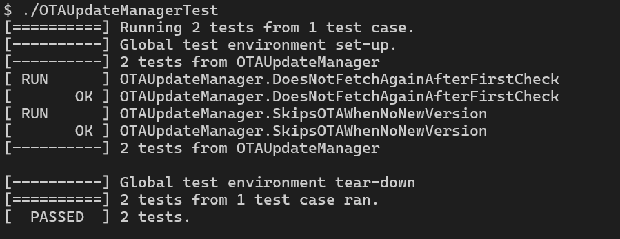

These are unit tests for Shuttle-Tracker-Node using GoogleTest - Google Testing and Mocking Framework
// https://github.com/google/googletest

You need to install GoogleTest in order to run these unit tests.

TelemetryManager testing:

+Parsing +CMTI → sending AT+CMGR=…
+Handling “get location” → issuing an SMS
+JSON formatting and HTTP PUT path for Firebase

OTAUpdateManager testing:

+DoesNotFetchAgainAfterFirstCheck verifies that on the first checkAndUpdate() call, a fetch + OTA run happens when shouldFetch=true, and on the second call nothing runs because the hasChecked flag is set.
+SkipsOTAWhenNoNewVersion ensures that if shouldFetch=false, the manager still checks once but does not trigger performOTA().

